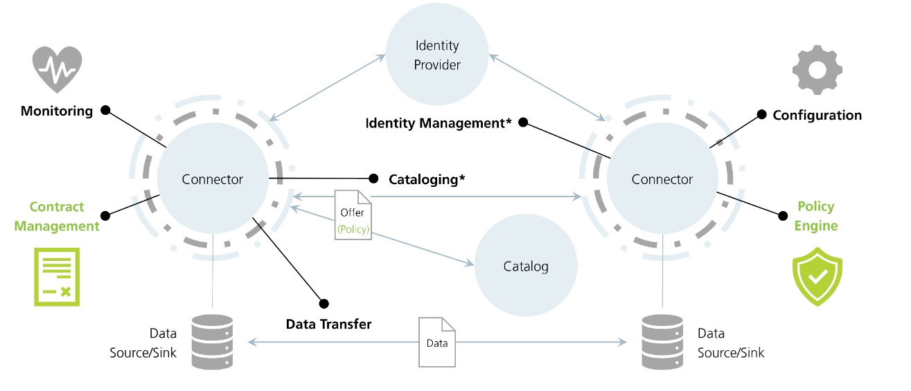
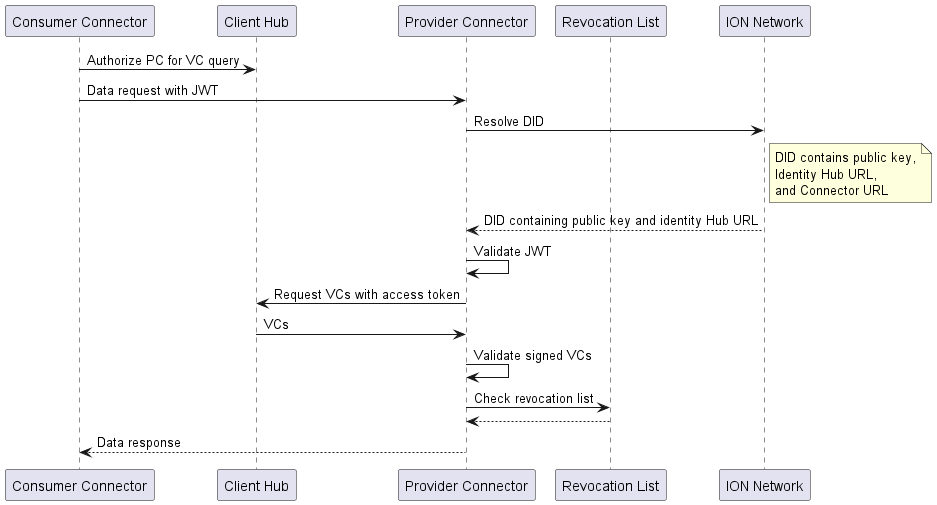
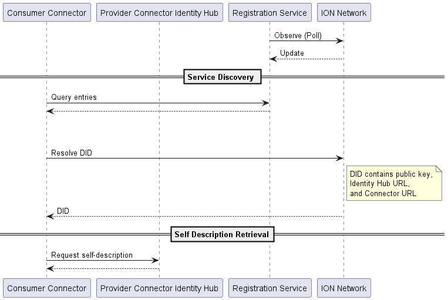
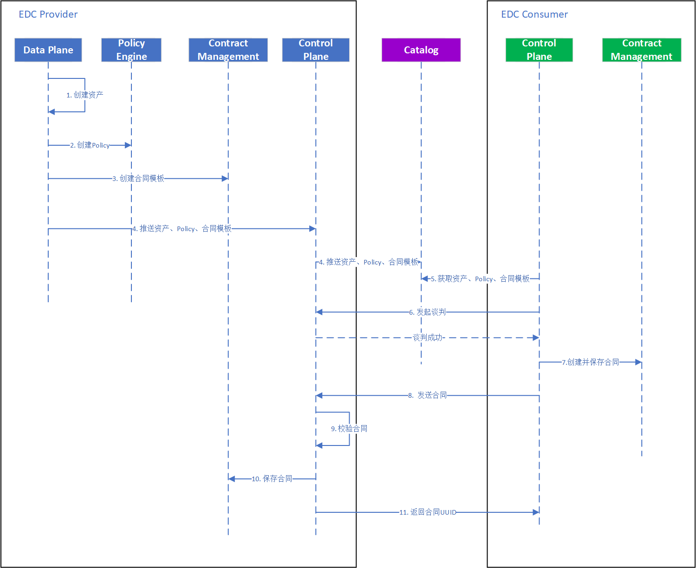
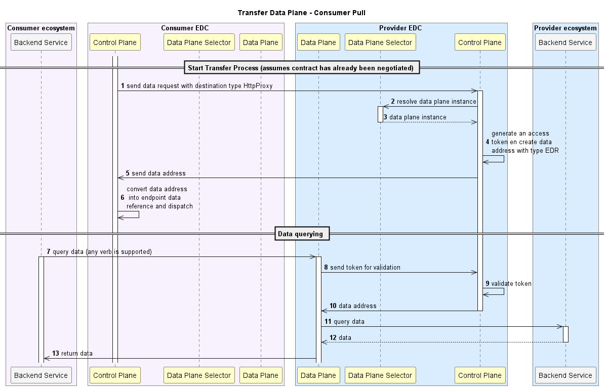
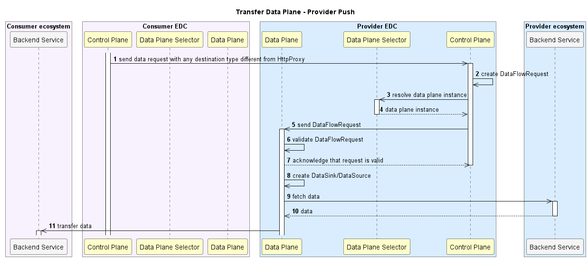

# EDC 总结

## 1. 架构

## 2. 组件
### 2.1 Monitor
监视器，用于观察系统运行状态、指标参数等
### 2.2 Identity Provider
用于给各Connector标识身份

### 2.3 Connector
连接器，主要负责将Producer和Consumer连接到数据空间, 其包含以下几个组件:
- Control Plane: 控制平台，负责通知数据平台、生成access token以及data address等
- Data Plane Selector: 数据平台选择器，用于选择合适的数据平台
- Data Plane: 数据平台，从业务系统中获取数据
- Contract Management: 负责合同全生命周期的统一管理
- Policy Engine: 负责生成及管理Policy， Policy可理解为数据访问控制

### 2.4 Catalog
用于存储并展示数据交换中涉及到的所有上下文内容，如合同、Policy、session等

### 2.5 Data Source
数据源，负责数据的获取、采集等

### 2.6 Data Sink
数据箱，负责数据存储

## 3. WorkFlow
### 3.1 身份管理
- 数据请求

- 服务发现

### 3.2 签署合同

### 3.3 Data Transfer
- Consumer Pull

- Provider Push
